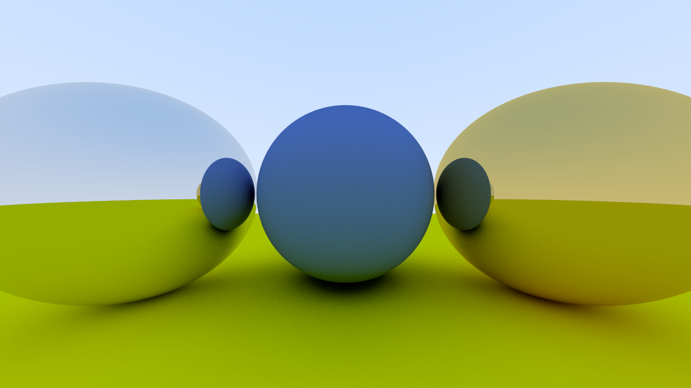
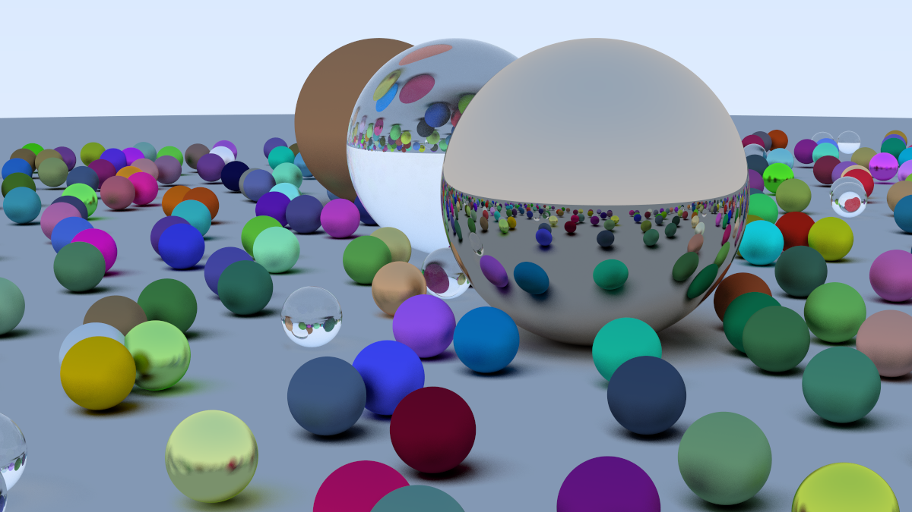

# A CPU based raytracing renderer

Based on 

## Todo

- [x] Port to SDL (or some other way of drawing to the screen rather than file)
- [ ] Refactor camera (+ decide on SDL interface)
- [ ] BVH or octree to reduce calls to shape.hit
- [ ] More shapes
- [ ] Look into voxel stuff :>
  - https://dubiousconst282.github.io/2024/10/03/voxel-ray-tracing/

## Benchmarks

- Baseline (based on book): 27m10.739s
- Multithreading (6 cores, 12 threads): 3m20.095s

## Screenshots

